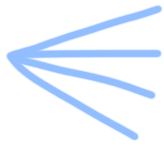
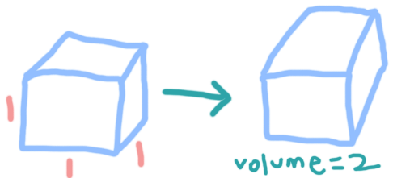

# Lecture 1 Notes

> Question 1:  
> Trisect an angle using a compass and a straight edge  
>   
> *need a compass  
> *cannot do with only a straight edge

> Question 2:  
> Double the volume of a cube using a straight edge  
> 

### History
800's AD:
- Al-Khawrazmi
    - algebra
    - arithmetic

1500's:
- cubic equation

1800's:
- Abel-Ruffini
    - degree 5 polynomials don't generally have a solution that can be represented by radicals
- Galois
    - $ x^5 -x - 1 = 0 $ has no radical solutions
    - later on, Piere Wantzel:
        - discovered that Question 1 and Question 2 are impossible

Important Book Later On:
- Newton's Principia Mathematica
    - solving polynomial equations approximately

Gauss:
- Disquisitions Arithmatica
    - FFT (earlier than Cooley/Tukey)

1900's:
- Hilbert and Russell
    - Formalist school
        - try to reduce math to formal manipulation of symbols

Kurt Godel:
- incompleteness theorem
    - no matter how strong a (or what) system for number theory you "take", there are statements that are "true", but you cannot prove them

[True Statements] <- box  
[Proofs] <- another box

*roughly count the number of true statements, if true statements > proofs, some true statements have no proof

### Models of Computation
- finite state machines
    - cannot do much
    - show properties and limitations
    - memory less/finite memory
- finite state machines with unlimited stack memory
    - can do more than finite state machines
- turing machine
    - a little different than computers

All of the machines also have languages:
- regular languages
- context free languages
- unrestricted languages
- other versions/languages

