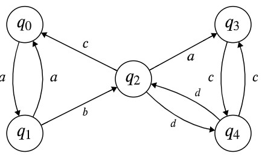

# Lecture 15 Notes

Example:

$\alpha_{q_0, q_4}^{\{q_0, q_1, q_2, q_3, q_4\}}$  
$= \alpha_{q_0, q_4}^{Q \setminus \{q_2\}} + \alpha_{q_0, q_2}^{Q \setminus \{q_2\}} (\alpha_{q_2, q_2}^{Q \setminus \{q_2\}})^* \alpha_{q_2, q_4}^{Q \setminus \{q_2\}}$

$\alpha_{q_0, q_2}^{Q \setminus \{q_2\}} = \alpha_{q_0, q_2}^{Q \setminus \{q_1, q_2\}} + \alpha_{q_0, q_1}^{Q \setminus \{q_1, q_2\}} (\alpha_{q_1, q_1}^{Q \setminus \{q_1, q_2\}}) \alpha_{q_1, q_2}^{Q \setminus \{q_1, q_2\}}$

$= \emptyset + a(aa + \epsilon)^*b \equiv a(aa)^*b$

$\alpha_{q_2, q_2}^{Q \setminus \{q_2\}} = \alpha_{q_2, q_2}^{Q \setminus \{q_1, q_2\}} + \alpha_{q_2, q_1}^{Q \setminus \{q_1, q_2\}} (\alpha_{q_1, q_1}^{Q \setminus \{q_1, q_2\}}) \alpha_{q_1, q_2}^{Q \setminus \{q_1, q_2\}}$

### Some simplification rules for regular expressions: 

$\alpha + \emptyset \equiv \alpha \equiv \alpha + \alpha \equiv \alpha \epsilon \equiv \epsilon \alpha$  
$(\alpha \beta) \gamma \equiv \alpha(\beta \gamma) \equiv \alpha \beta \gamma$  
$(\alpha + \beta)\gamma \equiv \alpha \gamma + \beta \gamma$  
$\alpha \emptyset \equiv \emptyset \equiv \emptyset \alpha$  
$\epsilon + \alpha \alpha^* \equiv \alpha^*$  
$\alpha$ 

I DONT UNDERSTAND ANYTHING WHAT HE JGSRDKJG JAKERDFVGKJERS,DFK GJERSNDFG,RJDKFJ fuck.