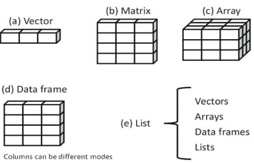

# Lecture 2 Notes

## Datasets !

### Introduction
In order to work with data, it must be stored in an appropriate format

Often times you work with data frames or .csv files

With *R*, you:
- select a data structure to store your data
- enter the data into this structure

Nowadays there are many data structures available for use with *R*

### Data Structures
   
The types of data structures available in *R* include:
- scalars
- vectors
- matrices
- arrays
- data frames
- lists

Data frames:
- hold data
- columns are variables and rows are observations
    - ex: each row may represent a person, and the columns would represent eye colour, height etc.
- you can use variables of different types in the same data frame
    - ex: numeric and categorical data in the same data frame

Examples of data structures:



### Objects

An object in *R* is a data object which has a class attribute
- Examples include all of the data structures in the photo, but also include constants, functions, and graphs
- essentially, everything in *R* is an object
- objects have a mode (which describe how the object is stored) and a class (which tells *R* functions how to handle the data)

### Vectors

Vectors are 1-dimensional arrays that hold numeric, character, or logical data
- formed using the combine function `c()`
- data must be of the same type, meaning you cannot mix modes in a vector
    - ie. you can't have a categorical and numerical value in a vector
- scalars are vectors that contain 1 element
    - used to hold constants (ex: `f <- 5`, `h <- FALSE`)
- can refer to elements in a vector by referencing their position within the vector
    - used to pull out specific elements
- colon operator `:` generates a sequence of numbers between 2 bounds (bounds are inclusive)
    - use () for numbers and [] for iteration
        - ex: `vector[2:6]` will pull columns 2-6
    - ex: if you wanna create a vector with 50 columns you can write `vector(1:50)`

```R 
# the three types of vectors:

# a = Numeric
a <- c(1, 2, 5, 3, 6, -2, 4)

# b = Character
b <- c("one", "two", "three")

# c = Logical
c <- c(TRUE, TRUE, TRUE, FALSE, TRUE, FALSE)

# refer to the second and fourth elements of vector a
d <- a[c(2, 4)]

# output d
d

OUTPUT: 
# a's second and fourth element (seems like index starts at 1 when pulling elements)
[1] 2 3
```

```R
# use : to generate a sequence of numbers
e<- c(2:6)
e

OUTPUT:
[1] 2 3 4 5 6 
```

### Matrices and Arrays

A matrix is a 2-dimensional array
- data must be of the same type, numerical, character, or logical (you still cannot mix modes in a matrix)
- formed using the `matrix()` function
    - format: `newmatrix <- matrix(vector, nrow, ncol, byrow, dimnames = list(rownames, colnames))`
        - `vector` contains the elements for the matrix
        - `nrow` and `ncol` specify the row and column dimensions (number)
        - `byrow` indicates whether the matrix should be filled in by row (`byrow = TRUE`) or by column (`byrow = FALSE`)
        - `dimnames` contains optional row and column labels `rownames` and `colnames` stored in character vectors
    - `X[i, ]` refers to the ith row of matrix X
    - `X[ ,j]` refers to the jth column of
    - `X[i, j]` refers to the ijth element 
- matrices by default are filled going down a column, left to right

```R
# create a 5x4 matrix filled with integers 1-20
y = matrix(1:20, nrow = 5, ncol = 4)
y

OUTPUT:
     [,1] [,2] [,3] [,4]
[1,]    1    6   11   16
[2,]    2    7   12   17
[3,]    3    8   13   18
[4,]    4    9   14   19
[5,]    5   10   15   20
```

```R
# get the elements in the first row, and 4th and 5th column of matrix y
cd <- y[1, c(3,4)]
cd

OUTPUT:
[1] 11 16
```

Arrays are similar to matrices but can have more than two dimensions
- formed using the `array()` function

```R
# create a 3D, (2 × 3 × 4) array of numbers 1-24 with labels (dimnames)
dim1 <- c("A1", "A2")
dim2 <- c("B1", "B2", "B3")
dim3 <- c("C1", "C2", "C3", "C4")

z <- array(1:24, c(2, 3, 4), dimnames=list(dim1, dim2, dim3))
z

OUTPUT:
, , C1

   B1 B2 B3
A1  1  3  5
A2  2  4  6

, , C2

   B1 B2 B3
A1  7  9 11
A2  8 10 12

, , C3

   B1 B2 B3
A1 13 15 17
A2 14 16 18

, , C4

   B1 B2 B3
A1 19 21 23
A2 20 22 24
```

```R
# create the same array without labels (dimnames)
z <- array(1:24, c(2, 3, 4))
z

OUTPUT:
, , 1

     [,1] [,2] [,3]
[1,]    1    3    5
[2,]    2    4    6

, , 2

     [,1] [,2] [,3]
[1,]    7    9   11
[2,]    8   10   12

, , 3

     [,1] [,2] [,3]
[1,]   13   15   17
[2,]   14   16   18

, , 4

     [,1] [,2] [,3]
[1,]   19   21   23
[2,]   20   22   24
```

### Data Frames

- can be of mixed type, numerical, character, or logical (you can mix modes in a data frame)
- formed using the `data.frame()` function
    - to select a column in R you can use brackets and specify elements by column number, eg. `DataFrameName[ ]`
        - can also specify using column names, eg. `DataFrameName[c(colname1, colname2)]`
- each column can only have one mode, but different columns can have different modes
- columns usually represent variables
- most popular data type in *R*
- use `$` to pull out variables in a specific column
    - will return the values in a row

```R
# initialize data as vectors
patientID <- c(1, 2, 3, 4)
age <- c(25, 34, 28, 52)
diabetes <- c("Type1", "Type2", "Type1", "Type1")
status <- c("Poor", "Improved", "Excellent", "Poor")

# create data frame
patientdata <- data.frame(patientID, age, diabetes, status)
patientdata

OUTPUT:
  patientID age diabetes    status
1         1  25    Type1      Poor
2         2  34    Type2  Improved
3         3  28    Type1 Excellent
4         4  52    Type1      Poor
```

```R
# fetch columns 1 and 2 and store in ef
ef<-patientdata[1:2]
ef

OUTPUT:
  patientID age
1         1  25
2         2  34
3         3  28
4         4  52
```

```R
# fetch columns "diabetes" and "status" and store in gh
gh<-patientdata[c("diabetes", "status")]
gh

OUTPUT:
  diabetes    status
1    Type1      Poor
2    Type2  Improved
3    Type1 Excellent
4    Type1      Poor
```

```R
# fetch age data and store in ij
ij<-patientdata$age
ij

OUTPUT:
[1] 25 34 28 52
```

```R
# produce a table of "diabetes type" against "status"
table <-table(patientdata$diabetes, patientdata$status)
table

OUTPUT:
        Excellent Improved Poor
  Type1         1        0    2
  Type2         0        1    0
```

### Factors

Variables can be nominal, ordinal, or continuous
- nominal variables are categorical, without an implied order
    - ex: Diabetes (Type1, Type2)
- ordinal variables imply order but not amount
    - ex: Status (poor, improved, excellent)
        - you know that improved is better than poor, but you don't know by how much because ordinal variables have no amount
- continuous variables can take any value within a range, and both order and amount are implied
    - ex: Age in years
- categorical variables, both nominal and ordinal, are called factors in *R*
- function `factor()` stores a variable as categorical data
- for ordinal variables, add the parameter `ordered = TRUE` to the `factor()` function
- factor levels for character vectors are crated in alphabetical order by default
    - can change the level order using the levels option

### Lists

A list is an ordered collection of objects
- most complex data structures in *R*
- can contain vectors, data frames, other lists etc. all combined under one name
- formed using the `list()` function
- can specify elements of a list by indicating a component within double brackets `[[ ]]`
- in *R*, many functions return lists
    - need to select components of interest to you
